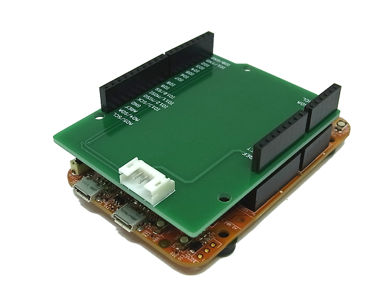
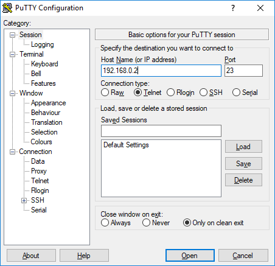

How to use the Uart WiFi Board
========================================

The easiest way is using micro controller board which has arduino form-factor pinout.  

First of all
--------------
The Uart WiFi Board is programmed [Uart WiFi Bridge software](https://github.com/NaoNaoMe/Uart-WiFi-Board/tree/with-display/Software/UartWiFiBridge).  
You will need the following items for uploading program.
 - Arduino or Arduino form-factor board
 - [Communication Shield](https://github.com/NaoNaoMe/Communication-Shield)
 - [Communication cable](https://github.com/NaoNaoMe/Communication-Shield/tree/master/Cables)
 - TeraTerm


Sample software for your board
--------------
These software serial configurations are 9600 bauds, 8-bit data and no parity.

Arduino
```
void setup() {
  Serial.begin(9600);
  Serial.println("Hello World !");
}

void loop() {
  if (Serial.available() > 0) {
    Serial.write(Serial.read() + 1);
  }
}
```

Mbed
```
#include "mbed.h"

Serial pc(D1, D0);  //for FRDM boards
//Serial pc(SERIAL_TX, SERIAL_RX);  // for Nucleo boards

int main() {
  pc.printf("Hello World !\n");
  while(1) {
    pc.putc(pc.getc() + 1);
  }
}
```


Hardware Setup
--------------
Attach the Communication shield in your micro-controller board. 

The Arduino UNO.


The Nucleo board.  
The Nucleo boards need some tricks about smd parts.  
All you need is that SB13 and SB14 are OFF, SB62 and SB63 are ON.


The FRDM board.


Connect the Communication shield to the Uart WiFi Board with the Communication cable like the following figure(E.g. Arduino).


Communication with your board
--------------
Press the SW1 button to turn on the Uart WiFi Board.  
The Uart WiFi Board is started, you can check SSID, IP address and baud rate on the display by pressing SW3 button.  

Execute TeraTerm to start the application and type the IP address of the Uart WiFi Board in the Host Name field.


Turn on your board. You can see "Hello World !" in the TeraTerm application.
When you type numeric character, your board return character like following.


It doesn't work?
--------------
Please check bitrate on your board.  
In addition, you need to make sure that your computer are on the same network segment as the Uart WiFi Board.


