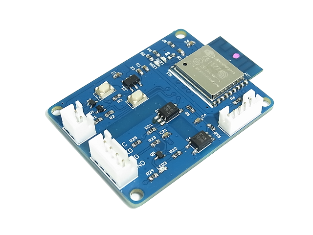
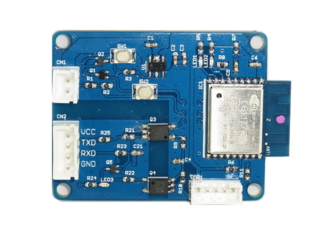

UartWiFiBoard
=========

  
The UartWiFiBoard is designed as asynchronous serial communication via WiFi.  
This board is based on ESP-WROOM-02(esp8266) chip and will be mainly used for the transparent WiFi-serial bridge.  
For running standalone, the board has a voltage regulator and some user-interfaces.  
The UartWiFiBoard is an easy way to connect your board wirelessly to the Internet.  
If you flash [Sample software](Software/UartWiFiBridge) on this repository, the board works as the transparent WiFi-serial bridge.
I made video that is [how to use UartWiFiBoard](https://youtu.be/4O-hJj3G7K0). You can watch it on Youtube.

### Some highlights of the UartWiFiBoard:
 1. Main core: ESP-WROOM-02(ESP8266).
 2. Voltage regulator(3.3V) with control pin.
 3. Opto-isolated UART interface(Uart interface circuit accepts 3.3V and 5.0V).
 4. On board WiFi-microcontroller can use following functions.
 	- LED1 connected to "IO0" H:OFF L:ON(the sample software indicate WiFi status)
 	- LED2 connected to "IO2" H:OFF L:ON(the sample software indicate UART activity)
 	- Control voltage regulator's control pin connected to "IO14" H:Enable L:Disabale(normally)
 	- Voltage detection circuit(for CN1) connected to "TOUT" with forced low switch(SW2)
		- The sample software use this feature due to prevent battery over-discharge and the switch(SW2) behaves like power-off function.
 5. Measures 40mm x 50mm x 10mm

Repository Contents
-------------------
* **/Hardware** - All Eagle design files (.brd, .sch)
* **/Software** - Software files for this hardware

Description(Pin Interfaces)
-------------------

### CN1(Primarily) Pin Descriptions:
This connector is the supply voltage and input for the voltage detector.
- **VBAT:** Up to 12.0VDC convert to 3.3VDC.
- **GND:** GND.

### CN3(Primarily) Pin Descriptions:
This connector is for Flashing a program to WiFi-microcontroller.
If you change BOOT MODE, To be selected BOOT MODE before supply voltage.
- **VCC:** Restrictly 3.3VDC.
- **TX:** UART TX.
- **RX:** UART RX.
- **GND:** GND.
- **BOOT MODE:** Connected to "IO0" H:Flash boot(normally) L:UART download

If you are interested in more useful uart module, please see the [General Serial Communication Board](https://github.com/NaoNaoMe/General-Serial-Communication-Board).

### CN2(Secondary) Pin Descriptions:
This connector is for your target boart UART-interface.
- **VIN:** This is the power supply pin with a voltage range of 2.7 to 5.5VDC.
- **TX:** UART TX(Open collector output).
- **RX:** UART RX.
- **GND:** GND.

How to upload program
-------------------
See [this page](UploadProgram.md)

License
-------------------
The repository is released under [Creative Commons ShareAlike 4.0 International](https://creativecommons.org/licenses/by-sa/4.0/).

Distributed as-is; no warranty is given.
