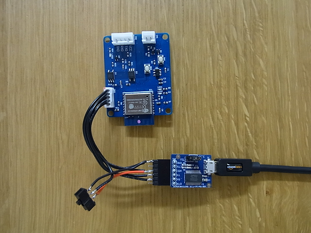

Upload a program for UartWiFiBoard
========================================

First of all
--------------
You will need the following items for uploading program.
 - FTDI BREAKOUT BOARD(3.3V)
 - reprogramming cable(you should assemble it.)

Hardware Setup
--------------
Refer to the figure below to make reprogramming cable.  
  
After making the cable, connect to UartWiFiBoard.  

Upload a program
--------------
Before you upload your program, please check whether the switch position is tied low(GND).
The ESP8266 needs to be put into flash mode.

### Arduino IDE
Open up [the sample sfotware](Software/UartWiFiBridge) or your own software in the Arduino IDE.  
The board selection and programming configuration are in the figure below.  
  
Click the Upload button in the IDE. Wait a few seconds. If successful, the message "Done uploading." will appear in the status bar.

### esptool
Of course, you can upload a program with esptool.  
Here are some of the most helpful websites that you may use esptool.  
[Flashing esp-link](https://github.com/jeelabs/esp-link/blob/master/FLASHING.md)  
[Flashing the firmware](https://nodemcu.readthedocs.io/en/master/en/flash/#putting-device-into-flash-mode)
