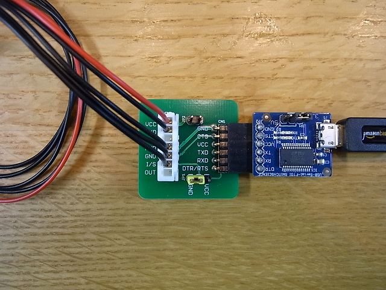
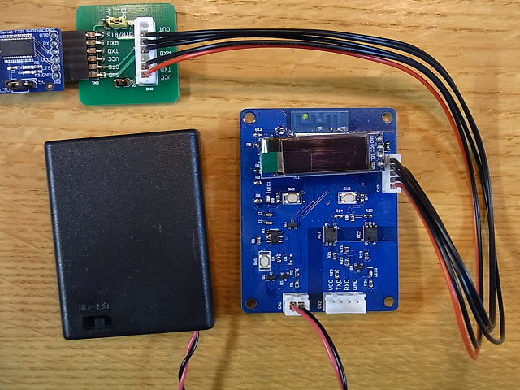
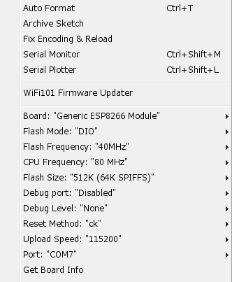
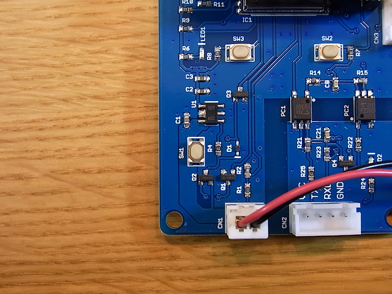

Upload a program for the Uart WiFi Board
========================================

First of all
--------------
You will need the following items for uploading program.
 - FTDI Breakout Board(3.3V)
 - [FTDI Breakout Adapter](https://github.com/NaoNaoMe/FTDI-Breakout-Adapter)
 - [Programming cable](https://github.com/NaoNaoMe/FTDI-Breakout-Adapter/tree/master/Cables)


Hardware Setup
--------------
Connect the FTDI Breakout to the FTDI Breakout Adapter with the Programming cable like the following figure.
The JP1 on the FTDI Breakout Adapter is jumped to GND. The JP2 is not jumped.



Upload a program
--------------
Plug the Programming cable into the CN2 on the Uart WiFi Board.  


### Sample software
If you want to try [sample software](), you can modify the following configurations.
```
const char* ssid = "TestSSID0123";
const char* password = "TestEncryptionKey0123";

int serialSpeedIndex = 0;   //9600bps
```


### Arduino IDE
Open up [the sample software](Software/UartWiFiBridge) or your own software in the Arduino IDE.  
The board selection and programming configuration are in the figure below.  
  

Press SW1 button in order to turn on the Uart WiFi Board. Please hold on SW1 button while uploading software.  


Click the Upload button in the IDE. Wait a few seconds.  
The message "Done uploading." will appear in the status bar, unplug the Programming cable from the Uart WiFi Board.  


